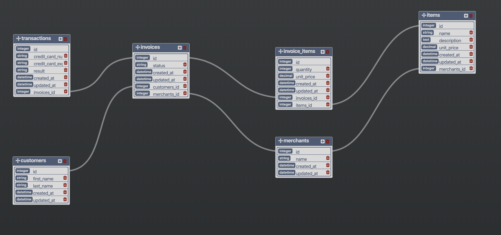

# Welcome to Rails Engine 👋

> An api exposing sales related data



#### 1. GET `/api/v1/merchants`

This endpoint will return all of the merchant records.

> example response to request `/api/v1/merchants`

```
{
  "data": [
    {
      "id": "1",
        "type": "merchant",
        "attributes": {
          "name": "Mike's Awesome Store",
        }
    },
    {
      "id": "2",
      "type": "merchant",
      "attributes": {
        "name": "Store of Fate",
      }
    },
    {
      "id": "3",
      "type": "merchant",
      "attributes": {
        "name": "This is the limit of my creativity",
      }
    }
  ]
}
```

#### 2. GET `/api/v1/merchants/:id`

This endpoint will return the associated record.

> example response to request `/api/v1/merchants/2`

```
{
  "data": {
    "id": "2",
    "type": "merchant",
    "attributes": {
        "name": "Klein, Rempel and Jones",
        "id": 2
    }
  }
}
```

#### 3. GET `/api/v1/merchants/find`

This endpoint will find the record based off the query parameters.

> example response to request `/api/v1/merchants/find?name=Eichmann-Turcotte`

```
{
  "data": {
    "id": "75",
    "type": "merchant",
    "attributes": {
        "name": "Eichmann-Turcotte",
        "id": 75
    }
  }
}
```

| param      | description                          |
| ---------- | ------------------------------------ |
| id         | search based on the primary key      |
| name       | search based on the name attribute   |
| created_at | search based on created_at timestamp |
| updated_at | search based on updated_at timestamp |

## Author

👤 **Hillary Stewart**

- Github: [@hillstew](https://github.com/hillstew)
